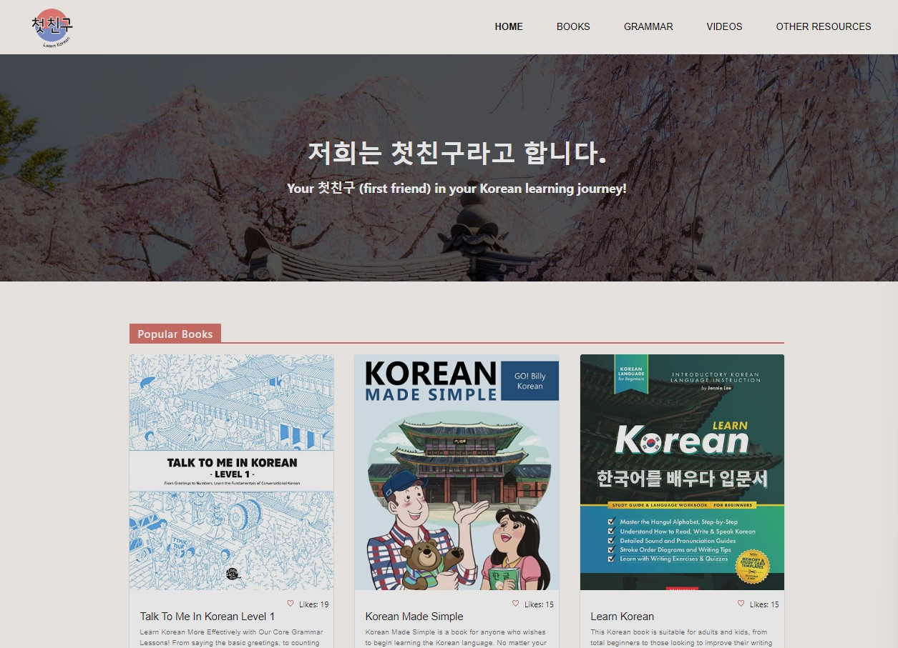
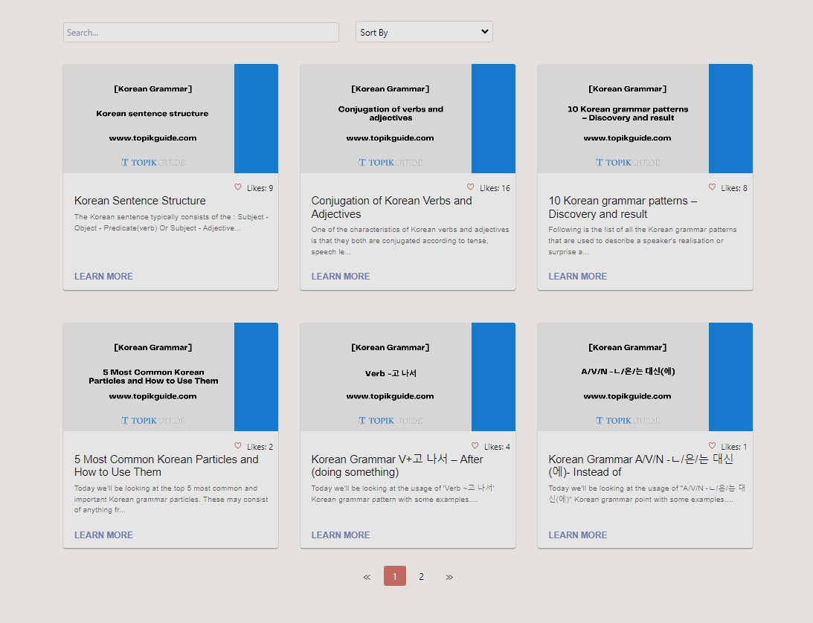
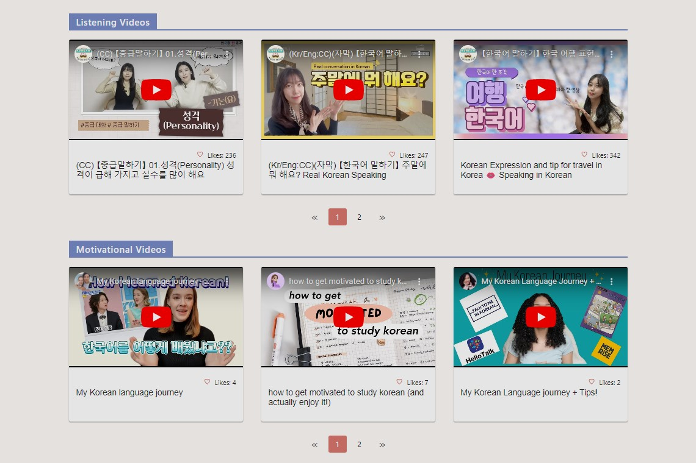
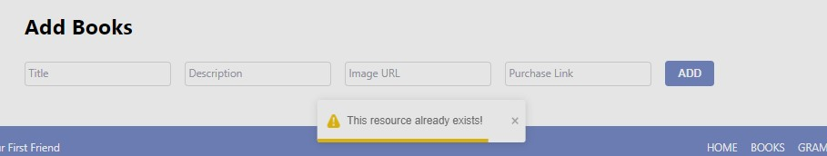

# First Friend

## Created By

Mai Garcia, Elisabeth Garcia, and Katherine West

## About

Welcome to **First Friend (첫친구)**, a website designed for learners of the Korean language to find and share a variety of studying resources. To create a comprehensive collection of learning materials, we have included a page for books, grammar resources, videos, and a catch-all page for other miscellaneous resources, such as apps and dictionaries. 
 

On the homepage, users will find the top three most popular resources in each four categories, marked by a header describing the type of resource it is. The most popular resources update dynamically based on the number of likes of each item.

For books, grammar, and miscellaneous resources, each resource card has an image, title, description, action button (such as "BUY NOW" or "LEARN MORE"), and like button. Clicking the action button will open a new tab in which users will be directed to the link to either purchase the book or view the original resource. Video resources populate as embedded videos with their preset thumbnails, and do not have descriptions or links. 

On the resource pages (other than "Videos"), you can search for a specific item by name or description. You can also sort by item name or popularity, which is again based on the number of likes of each item. The page uses pagination to show 6 resources at a time, which does not affect the searching or sorting functionalities.

The video page features separate pagination for each of the three categories of videos.

Each resource page has a form on the bottom where users can add their own resources. The fields include the name, description, image, and associated link of the resource. For videos, there is a dropdown to select the category of the new resource. 

When the user successfully submits a new resource, a confetti animation will play, the window will scroll back to the top, and the new resource will appear. If the user attempts to submit a resource that already exists, a warning message will appear below the form and the resource will not be added.

## Technologies Used
* React
* Tailwind
* Material UI